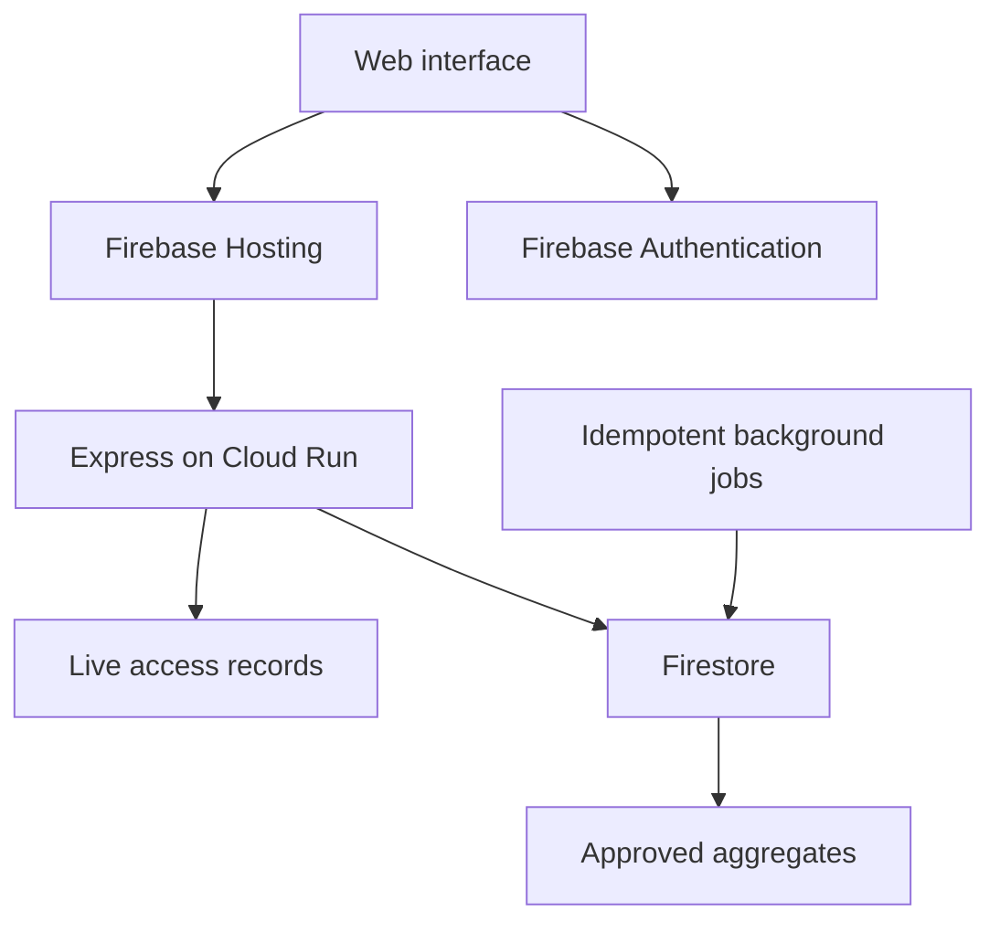
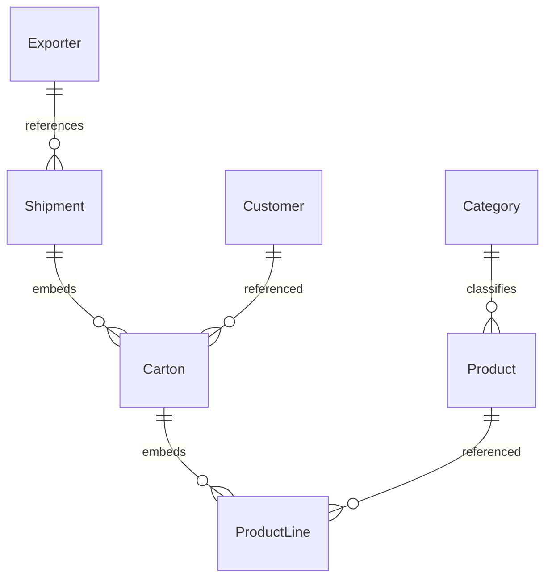

# Asian Cargo — business requirements and modernization baseline

Review date: 2026-10-05. Source baseline: main, commit 126589b961fe28079d38f2c41dcadda2c5c94da9. Implementation branch: modernization/security-foundation.

This is a source-derived baseline, not stakeholder-approved requirements or a production data audit. No production database, credentials, cloud settings or executable desktop session were accessed. No existing test suite was found in package.json. Findings are not exhaustive. Proposed roles, targets and transitions require validation.

## Executive decision

Modernize the existing Express/Firebase application incrementally. Keep Firestore initially, move privileged backend execution out of the distributed Electron app, and introduce a web interface served by Firebase Hosting with an Express API on Cloud Run. Retain Firebase Authentication. Do not commit service account keys or distribute them with desktop builds. Cloud Functions remain suitable for small scheduled/event jobs after their consistency contracts are defined.

The existing business scope is cargo shipment preparation, exporter/customer master data, goods/categories/units, quotations, clearing and generated shipment documents. There is no evidence supporting a general ERP rewrite, payroll, purchasing or general ledger implementation.

## As-is inventory and evidence

| Module | UI evidence | API/service | Persistence | Existing tests at baseline |
|---|---|---|---|---|
| Login | views/index.html; public/app/js/Firebase.js | routes/authentication.js sessionLogin/autheticate | Firebase Auth; SYSTEM/CONFIG | None found |
| Exporters | public/app/js/editExporter.js | exporter.js addExporter/getExporter | Exporter | None found |
| Customers/pricing | public/app/js/customer/* | customer.js addCustomer/updateCustomerPriceList | Customer | None found |
| Goods/categories | public/app/js/goods/goods.js; category/category.js | products.js | Product, Category, Unit | None found |
| Shipment preparation | public/app/js/shipmentInput/* | syncShipment.js syncShipment/addShipment | Pending, Shipment, Exporter | None found |
| Shipment browsing | public/app/js/shipment/shipment.js | shipment.js getAllShipment | Shipment, Exporter | None found |
| Invoice/report generation | shipment/Invoice.js, CustomerInvoice.js, packinglist.js, deliveryReport.js | shipment.js createInvoice/createCustomerInvoice | Shipment nested data | None found |
| Weight/header edits | shipment/weight.js, header.js | weightUpdate.js, updateShipmentHeader.js | Shipment | None found |
| Quotations | quotation/quotation.js | quotation.js | Quotation | None found |
| Clearing | clearing/clearing.js | clearing.js | Clearing | None found |
| User directory | users/users.js | authentication.js getAllUsers | Firebase Auth | None found |
| Spreadsheet import | routes/js/readExcel.js | readExcel.read | No completed persistence flow observed | None found |

Architecture observed: Electron main.js starts bin/www, which serves Express app.js on port 3000. EJS renders HTML, and browser JavaScript plus Semantic UI provides operational screens. Express handlers call firebase-admin directly. The baseline imports a missing serviceAccountKey.json. README is empty. No deployment, index or database rule definitions were found in the reviewed root inventory.

### Workflow trace

1. Browser exchanges Firebase ID token for session cookie through POST /sessionLogin.
2. Operators maintain exporters, customers and product catalog via Express handlers.
3. Shipment preparation stores drafts in Pending/{user_id}, as dynamic map keys.
4. addShipment constructs an identifier from exporter plus shipment number. A client-provided index determines create/update behavior. The handler removes draft keys before the shipment write, merges status-specific carton maps and updates exporter numbering separately.
5. Shipment browsing joins exporter metadata in application code and returns HTML fragments mixed with data.
6. Invoice actions merge client-supplied fields into Shipment. Report rendering resides largely in browser code.

Observed statuses are dynamically supplied strings in status[], activeStatus and status-named maps. SYSTEM/SHIPPINGPROCESS is read by system.js. The actual configured state vocabulary was not available. Do not equate these strings with an approved logistics state machine.

Inferred intent: preserve cargo grouping across shipping stages, support repeatable paperwork, and maintain customer-specific prices. These are interpretations, not validated business rules. Cancellation, approval, dispute, financial posting and recovery semantics are not established by the source review.

## Verified issue register

“Fixed” means patched and locally inspected/tested as described, not deployed or production-verified.

| ID | Severity | Evidence/root cause and impact | Verification/reproduction | Status / action |
|---|---|---|---|---|
| SEC-01 | Critical | app.js mounts business handlers without authentication; Admin SDK writes lack a shared guard | Trace /addCustomer or /createInvoice from registration to Firestore: no identity boundary in baseline | Fixed boundary; dependency-injected negative tests. Fine-grained permissions remain backlog |
| SEC-02 | Critical | /manualUpdateShipment invokes customer.manualUpdateShipment with a hard-coded shipment map | Inspect customer.js final write; do not invoke against production | Disabled with 410; historical data impact unknown |
| SEC-03 | High | authentication.getAllUsers returns user.toJSON without permission checks | Inspect response construction | Allowlisted fields and users:read permission; pagination still needed |
| SEC-04 | High | session verification uses checkRevoked=false | Revoked session accepted until expiration in baseline design | Shared guard verifies with true and live Access record; unit test |
| SEC-05 | High | bin/www listens on all interfaces; packaged Admin credential architecture exposes privileged backend locally | Inspect server.listen and credential import | Defaults to loopback; uses ADC. Desktop credential distribution must cease |
| DATA-01 | High | syncShipment.addShipment deletes Pending entries before writes; writes Shipment and exporter counter separately | Inject write failure in future emulator regression test | Confirmed code defect; transactional redesign pending business sequence rules |
| DATA-02 | High | syncShipment.syncShipment read-modify-set can overwrite concurrent draft edits | Concurrent reads yield same snapshot | Confirmed race in algorithm; emulator reproduction pending |
| DATA-03 | High | invoice/customer handlers merge request data without field schemas | Trace createInvoice/createCustomerInvoice | Confirmed missing validation; authenticated malformed writes remain possible |
| LOGIC-01 | High | checkIsActive fails to return promise; attempts month-end financial mutation and random amount; db.firestore.FieldValue is invalid | Inspect authentication.js | Replaced with read-only config result; financial automation explicitly deferred |
| API-01 | Medium | /updateProducts calls nonexistent products.addOrUpdateClearing | Compare exports in products.js | Explicit 501; correct update contract remains unresolved (products.updateProducts also calls collection.set) |
| API-02 | Medium | readExcel logs contents, immediately returns error, no completed import | Inspect readExcel.read | Confirmed, unresolved; disable in rollout until import contract exists |
| REPORT-01 | Medium | getAllShipment counts all matching documents but filters isActive after pagination | Compare count/query/data loop | Confirmed inconsistent counts and short pages; indexed query migration required |
| UI-01 | Medium | main.js calls removed/unprovided remote API and undefined window in download callback | Source inspection | Removed remote call; uses win; Electron runtime not executed |
| SEC-06 | Medium | Shipment status inserted into HTML strings without escaping | Inspect shipment.js statusDropdown | Suspected stored XSS path; exploit not executed; return structured data and render text |
| OPS-01 | High | No checked-in reproducible rules/indexes/migration/backup setup | Reviewed inventory | Baseline documentation added; cloud state unknown |

Do not interpret schema risks as proof of damaged production records. Full dependency vulnerability scanning and UI accessibility review remain outstanding.

## BRD: future-state requirements

Stakeholders proposed: business owner, cargo operations, finance/document staff, system administrator and auditor. Current source proves authenticated users, but not these role assignments. Initial scope is one organization; do not claim tenant isolation.

| ID | Requirement and acceptance criterion | Implementation/task | Verification |
|---|---|---|---|
| BR-01 | Every business endpoint requires valid identity and active provisioned access; denied requests make no business writes | SEC-01 middleware/access.js | test/access.test.js; HTTP integration pending |
| BR-02 | Directory access requires explicit permission and exposes only approved fields | SEC-03 authentication.js | Permission unit tests; response integration pending |
| BR-03 | Shipment creation, numbering and draft removal succeed atomically; retrying one request creates one result | DATA-01 transactional service + idempotency keys | Emulator concurrent submit/failure injection |
| BR-04 | Validate every product/customer/shipment field server-side; reject unknown mutable fields | DTO schemas per handler | Invalid-input and mass-assignment tests |
| BR-05 | Status changes use approved transition matrix and preserve author/time/history | Status service, append-only audit | Invalid transition and concurrent edit tests |
| BR-06 | Invoice totals are recalculated server-side using approved currency, precision, freight and rounding rules | Finance specification then service | Golden examples approved by finance |
| BR-07 | Drafts remain private to their author; shared shipments obey assigned organization/resource scope | Pending subcollection migration | Cross-user read/write negative tests |
| BR-08 | Tables paginate/filter/sort consistently and counts match their dataset | shipment query contract | Multi-page fixture with inactive rows |
| BR-09 | Dashboard metrics disclose definition, date basis, filters and freshness | Analytics service | Fixture reconciliation; no fabricated live figures |
| BR-10 | Personal layouts are versioned, validated, resettable and do not affect data authorization | Preferences/{uid} | Invalid widget/source/schema version tests |
| BR-11 | Import supports preview, row errors, duplicate policy and atomic or explicitly partial commit | Replace readExcel prototype | Malformed files, duplicate rows, recovery |
| BR-12 | Recoverable backups, rehearsed migration and rollback precede cutover | Operational runbook | Staging restore/reconciliation record |

Out of scope: new ERP domains, unapproved financial calculations, automatic production deployments, multi-tenant SaaS billing and arbitrary user-written dashboard queries.

Proposed measurable targets: zero unauthorized writes in negative tests; zero lost accepted submissions in concurrency fixtures; all migrated record counts and identifiers reconciled; WCAG 2.2 AA design target; keyboard-complete primary workflow; reduced motion support; API p95 <500ms for paginated reads at an agreed staging workload. Performance targets require dataset and concurrency confirmation. Do not report them as achieved.

## Access model

Implemented transitional policy: Access/{Firebase UID} must exist with active:true and permissions array. legacy:operate allows legacy business operations; users:read allows the directory. Read from server on each request; missing/suspended/error fails closed. This is deliberately coarse and is NOT final domain RBAC. Provision records through a trusted administrative process in staging before testing the branch. Never expose direct client writes to Access.

Proposed matrix:

| Capability | Admin | Operations | Finance | Auditor |
|---|---|---|---|---|
| Identity/access administration | Yes | No | No | Read audit |
| Catalog and customers | Yes | Write | Read | Read |
| Shipment operations | Yes | Write within assignment | Read | Read |
| Finalize invoice/credit correction | Policy-controlled | No | Yes | Read |
| Reports/analytics | Scoped | Scoped | Scoped | Scoped |
| Personal dashboard layout | Own | Own | Own | Own |
| Shared defaults | Yes | No | No | No |

Invitation → pending activation → active → suspended → removed (proposed). Suspension updates server access first and revokes sessions. Removal retains required audit references and applies approved retention/deletion rules. Custom claims may drive UI hints; live application records control sensitive authorization. Admin SDK endpoints must enforce authorization themselves; client database rules cannot replace that boundary. No multi-organization access is permitted until a trusted organization assignment and resource scoping model exists.

## Architecture decision ADR-001

| Option | Fit | Trade-off |
|---|---|---|
| Hosting + Functions + Auth + Firestore | Existing data stack; suitable small event/API handlers | Express/desktop adaptation, session and CSRF changes, transaction/schema work still necessary |
| Hosting + Auth + Cloud Run + SQL | Useful if relational reporting and cross-entity constraints dominate | Largest data rewrite; schema and operational overhead unproven today |
| Hosting + Auth + Cloud Run + existing Firestore (recommended) | Reuses Express and data while centralizing privileges | Must redesign large nested shipment docs, validation, queries and audit; SQL reporting may later be justified |

Firebase Hosting serves assets and forwards dynamic requests; backend execution runs separately. Firebase Auth establishes identity, not application roles. Official docs checked 2026-10-05:
- https://firebase.google.com/docs/hosting/cloud-run
- https://firebase.google.com/docs/hosting/serverless-overview
- https://firebase.google.com/docs/auth/admin/manage-cookies
- https://firebase.google.com/docs/hosting/manage-cache

Hosting forwards only the specially named __session cookie. Existing session plus csurf cookie design must be redesigned and tested together before any Hosting rewrite. This branch intentionally does not pretend to be Hosting-ready. Prefer a reviewed same-origin session/CSRF design or an explicit bearer-token API contract; never simply rename one cookie and assume compatibility.

No numeric cost estimate is credible without traffic/data/region inputs. Planning scenario to validate: 20 staff, 1,000 shipments/month, 10 cartons/shipment, 50k API reads/day. Price model includes document and aggregation reads, writes, storage/index growth, backups, compute/request duration, egress and logs. Obtain regional current rates after measuring usage; no paid infrastructure has been created. No runtime/version support claim or pricing quote is made here.

## Data specification and migration

Observed entities: Exporter, Customer, Product, Category, Unit, Shipment, Pending, Quotation, Clearing, SYSTEM. Relationships are inferred document IDs/maps, not enforced foreign keys. Shipment combines exporter reference, dates, statuses, cartons and invoice attributes. Pending groups all drafts by user. Actual row counts and document sizes are unknown.

Carton and ProductLine in this diagram represent embedded structures, not observed top-level collections. Target: preserve legacy IDs; add schemaVersion, revision, createdAt/By, updatedAt/By; move drafts to per-user documents and consider carton subcollections after measuring reads and atomicity needs. Store monetary units/currency explicitly; exact numeric representation depends on finance decisions. Treat final documents as versioned snapshots with correction history, not arbitrary mutable merges.

Migration steps: export and verify backup → inventory counts/types/references → map old fields to versioned schema → dry-run transform into isolated project → reconcile IDs/counts/totals against approved definitions → dual-read compatibility tests → freeze writes/capture final delta → reconcile again → cut over with named owner. Rollback: keep old data untouched until acceptance; if new writes occurred, stop traffic and reconcile/replay journal before restoring, rather than blindly reverting and losing new records. Retention period and recovery objectives require owner approval.

## API and UI specifications

Keep legacy contracts behind the guard during migration. New API proposal: GET /api/shipments?cursor=&limit=&exporter=&status= returns structured rows, nextCursor and separately defined filtered count; POST /api/shipments requires idempotency key; PATCH /api/shipments/:id requires revision; POST /api/shipments/:id/transitions validates from/to; POST /api/shipments/:id/invoices accepts approved inputs, never computed totals. Standard errors: 400 validation, 401 identity, 403 scope, 404 absent, 409 revision/idempotency conflict, 503 dependency failure. Define exact payload schemas after confirming existing records.

Design direction: deep navy and teal, neutral light mode, readable numeric typography, clear hierarchy and restrained elevation. Dashboard: operational totals, pending work, recent activity; primary workflow: draft → validated carton editor → review → submit receipt. Tables remain flat and readable; subtle 3D depth belongs in navigation or empty states. Provide keyboard actions, visible focus, text alternatives, reduced-motion and mobile stacked editing. Do not make critical actions hover-only.

Layout schema proposal: version:1, widgets[{id,type,size,position}], filters, density, theme. Server validates approved widget IDs, numeric bounds and layout ownership; private per-user storage, admin-owned shared defaults, reset and version migration. No raw queries, HTML, JavaScript or permission overrides in configuration.

Metric contracts proposed:
- Active shipments: count of authorized Shipment with isActive=true; creation-date range, timezone explicitly selected; drill-down same query. Active is not equivalent to in-transit.
- Draft count: current user's Pending entries only; no global total exposed to operators.
- Carton weight: sum validated numeric weights with confirmed unit, scoped to selected shipment/stage; never sum different stages for the same carton.
- Invoiced totals: deferred until currency, status and correction rules are approved; never sum currencies without an explicit conversion policy.
All metrics return zero/empty state with freshness timestamp, never demonstration values presented as live data. Initial refresh on request; cache/aggregate invalidation must include access scope.

## Rollout, test strategy and runbook

1. Review baseline findings and approve access bootstrap in an isolated Firebase project.
2. Harden endpoint authorization, schemas, session login and response escaping; replace prototype import.
3. Define shipment numbering/status and invoice rules; implement transactional vertical slice and audit.
4. Add Cloud Run staging foundation, Hosting-compatible auth/CSRF and deploy automation with pinned supported dependencies.
5. Build dashboard and shipment editor; exercise desktop/tablet/mobile and keyboard paths.
6. Migrate remaining modules, analytics and layouts; rehearse restore and cutover.

Local setup: npm ci (not executed here); use a supported Node version validated against legacy dependencies; npm test runs dependency-free authorization tests. For server testing use an isolated project, GOOGLE_APPLICATION_CREDENTIALS outside the repository and GCLOUD_PROJECT; npm run start:server. Default bind is 127.0.0.1. Set HOST explicitly for a reviewed container environment. Never point development writes at production. npm start launches Electron and requires a graphical environment. Production NODE_ENV enables secure cookies and therefore requires HTTPS.

Before rollout provision Access/{uid}: {active:true, permissions:["legacy:operate"]}; add users:read only for authorized directory viewers. Existing users are denied until provisioned. Restrict Access writes to trusted administration. Validate live database rules separately; no rules were deployed by this change.

Executed: authorization unit tests and syntax checks only. Not executed: npm ci, full app boot, Electron launch, Firebase emulator tests, production reads, browser QA, migration, deployment or cost measurement. Current branch is a reviewed starting point, not enterprise completion. Security fixes reduce exposure but coarse legacy access still permits malformed business payloads.

Open decisions blocking faithful business implementation:
1. What are the exact shipment statuses and allowed transitions? Can stages be edited after invoicing?
2. Is numbering per exporter, global, or annually reset; must it be gapless?
3. Which currencies, weight units, freight/tax rules and rounding apply? What do 660 and 0.700 mean?
4. Is month-end SYSTEM/CONFIG billing intentional and who controls it?
5. Which staff have administrative/operations/finance access; are shipments shared or assigned?
6. Must Electron work offline, and must existing desktop printing/download workflows remain?
